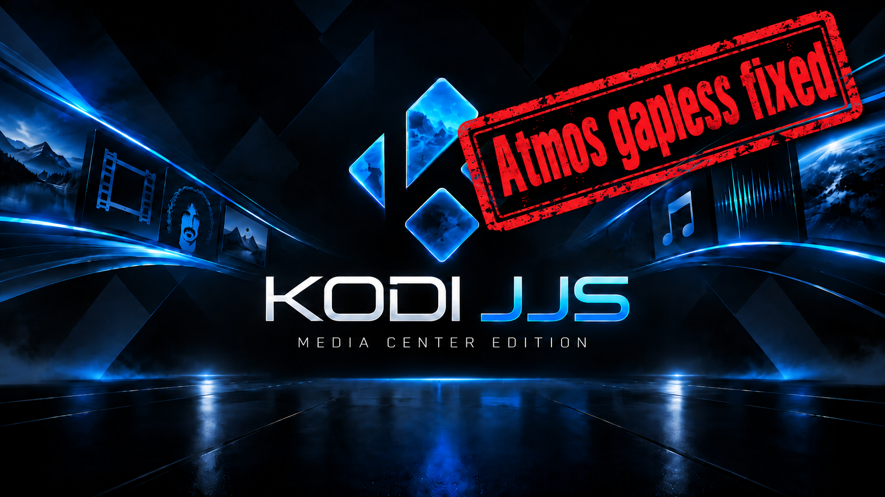

# Kodi JJS

## 1. What is Kodi JJS?

**Kodi JJS** is an unofficial fork of **Kodi 21.3 Omega** focused on one thing:
**seamless playback of consecutive Dolby TrueHD / Dolby Atmos tracks when using RAW passthrough.**

With standard Kodi, a track boundary can close and reopen the RAW AudioEngine stream even when the next track uses the same compatible audio format. The HDMI receiver then has to resynchronize, which can produce an audible gap.

Kodi JJS keeps the compatible audio path alive across the track change instead.

The result is simple:

> **No unnecessary HDMI / AVR resynchronization between compatible TrueHD / Atmos tracks.**

Kodi JJS otherwise stays as close as possible to standard Kodi. The project does not try to redesign Kodi or replace working upstream behaviour.

I originally created Kodi JJS for my own personal use because the audible interruptions in TrueHD / Atmos playback bothered me enough to fix them. I am making the source code and builds available for anyone else who has the same problem and may find this fork useful.

### Further Kodi Fixes

In addition to the gapless RAW / TrueHD / Atmos work, Kodi JJS carries a small set of independent Kodi core fixes found while using and testing the fork:

- **Manual Next / Previous and incompatible-format transition races – JJS.004**  
  Manual track changes could overlap asynchronous preparation with PAPlayer shutdown and leave stale or orphaned AudioEngine streams behind. Kodi JJS waits for outstanding queue work, closes the previous streams in a defined order and uses Kodi's normal reopen path when the actual output format changes.

- **PAPlayer restart with a stale start event – JJS.004**  
  A completed PAPlayer thread could leave its start event signaled. A following manual transition could then make the newly created playback thread exit before the new item became active. Kodi JJS clears that stale event before restarting the worker.

- **Playback callback blocked by audio file-state housekeeping – JJS.005**  
  Saving the outgoing audio file state could keep the application stack lock while database housekeeping ran. The successor playback callback needs the same lock, so audio could already be playing while the title and playlist marker still showed the previous track. Kodi JJS releases the lock before that audio-only housekeeping work.

- **False music tag-rescan path after database open failure – JJS.006**  
  `GetMusicNeedsTagScan()` can return a negative error value when the music database could not be opened. Stock Kodi treated every non-zero result as "tag scan required". Kodi JJS enters the rescan path only when the returned value is actually positive.

- **Cancelling a music-library update can leave the file counter alive – JJS.008**  
  The parallel `MusicFileCounter` used for percentage calculation checked the stop flag too late during recursive counting. Cancelling a large library scan could therefore leave the operation waiting for the counter to unwind. Kodi JJS checks the stop flag before new directory reads and inside the counting loops so cancellation returns promptly.

- **Destroyed Python `DialogProgressBG` can close unrelated progress displays – JJS.008**  
  Kodi's extended progress window is shared by multiple background-progress handles. Destroying one Python `DialogProgressBG` object closed that shared window instead of finishing only its own handle. Kodi JJS now marks only the owning handle finished, leaving other progress operations visible.

### Current release

**Kodi JJS 21.3-JJS.008 – Android ARM64 / LibreELEC Generic x86_64 / LibreELEC Raspberry Pi 4**

[Download the current release](https://github.com/jjs-hamburg/kodi-jjs/releases/tag/v21.3-JJS.008)

The Android build uses its own package name, **`org.jjs.kodi`**, so it can be installed **in parallel with standard Kodi**.

---

## 2. How to test

The fastest way to try Kodi JJS is with my
**[JJS KODI Toolbox](https://github.com/jjs-hamburg/jjs-kodi-toolbox)**.

You can move an existing Kodi installation to Kodi JJS in roughly **10 minutes**, including add-ons, databases, settings, skins and the rest of the Kodi profile.

### Android / NVIDIA Shield

1. Install **Kodi JJS** alongside your existing Kodi.
2. Start **JJS KODI Toolbox** on Windows.
3. Select your existing Kodi installation as **Source A** and Kodi JJS as **Target B**.
4. Transfer the complete Kodi profile.
5. Start Kodi JJS and test.

Because Kodi JJS uses a separate Android package, the existing Kodi installation remains untouched.

**Rollback:** simply start the original Kodi again. If you no longer want Kodi JJS, uninstall it.

### LibreELEC

JJS.008 provides LibreELEC 12.2.1 builds for **Generic x86_64** and **Raspberry Pi 4 (aarch64)**.

Before installing a JJS LibreELEC TAR:

1. Connect the Toolbox to the LibreELEC system.
2. Use **Create rollback**. This creates a rollback TAR directly from the currently installed LibreELEC `KERNEL` and `SYSTEM`.
3. Use **Download TAR** to store the JJS LibreELEC TAR on the device.
4. Use **Activate TAR as update** and reboot.

The existing `/storage` data, including the Kodi profile, remains in place during the LibreELEC update.

**Rollback:** use **Restore rollback** in the Toolbox and reboot. This restores the LibreELEC system that was installed when the rollback was created.

### Known LibreELEC limitation

On the tested Intel HDA/HDMI LibreELEC systems, a small number of TrueHD/MAT track boundaries can still produce a brief audio interruption.

This remaining glitch is **separate from the Kodi JJS gapless and playback-state fixes**. It was already present before JJS.005 and has also been reproduced outside Kodi on the same Linux/Intel HDMI audio path. Most tested TrueHD/MAT transitions remain seamless.

---

## 3. What is changed?

### Standard Kodi

For consecutive RAW passthrough tracks, standard Kodi can drain and close the current AudioEngine stream and create a new one for the next track.

For TrueHD / Atmos this can mean:

`track ends → RAW stream closes → HDMI audio stops → new RAW stream opens → AVR resynchronizes → audio resumes`

Even when both tracks use a compatible output format, that teardown can create an audible gap.

### Kodi JJS

Kodi JJS changes the PAPlayer / AudioEngine transition so that a compatible successor can take over the already-running RAW stream:

`track ends → existing RAW / HDMI stream stays alive → next decoder takes over → playback continues`

The normal Kodi drain/reopen path is still used when the actual RAW output format is not compatible.

The gapless/audio changes include:

- **Seamless RAW handover in PAPlayer**  
  The next compatible RAW decoder is prepared before the current track ends. At the boundary, the existing AudioEngine stream is transferred to the successor instead of being unnecessarily recreated.

- **TrueHD MAT state preservation**  
  MAT padding and timing state are carried across compatible seamless transitions so that the TrueHD / Atmos output remains continuous.

- **RAW EOF backlog handling**  
  End-of-file handling waits for pending RAW parser data to drain instead of treating demux EOF as if all packed audio had already been consumed.

- **Chapter / end-offset fix**  
  The upstream correction for chaptered audio ending too early is included.

Additional release integration changes:

- **New Kodi JJS splash – JJS.007**  
  The Android ARM64, LibreELEC Generic x86_64 and LibreELEC Raspberry Pi 4 builds use the Kodi JJS splash screen.

- **LibreELEC update safety – JJS.007**  
  The JJS LibreELEC builds default automatic system updates to **manual** and disable update notifications so a standard LibreELEC update cannot silently replace Kodi JJS. Existing installations receive this setting once; later deliberate user changes are left untouched.

### Android identity

Android builds use:

- App name: **Kodi JJS**
- Package: **`org.jjs.kodi`**
- Kodi JJS artwork for the Android TV / NVIDIA Shield launcher presentation

This is what allows Kodi JJS and official Kodi (`org.xbmc.kodi`) to coexist on the same Android device.

### Source and portability

The JJS audio changes are in Kodi core and are not specific to NVIDIA Shield hardware.

Current development branch: **`21.3-Omega-jjs`**

For a more detailed technical description, see **[README.JJS.md](README.JJS.md)**.

---

## Upstream and license

Kodi is developed by **Team Kodi / XBMC Foundation**. Kodi JJS is an independent, unofficial fork and is not affiliated with or endorsed by Team Kodi.

This repository remains under Kodi's **GNU GPLv2** licensing.

- [Official Kodi website](https://kodi.tv/)
- [Official Kodi source](https://github.com/xbmc/xbmc)
- [Kodi documentation](https://kodi.wiki/view/Main_Page)

Kodi JJS is provided as-is, without warranty, support commitment or obligation to provide future updates.
